# Part 3 Progress Report

Ka Pui Cheung (they/them)

**Project:** Air Ticket Reservation System Part 3

**Course:** CS-UY 3083 Intro to Databases

## Completed Work So Far

I have successfully completed the local project setup needed to continue building Part 3:

- I have set up the environment variables needed for the application, including the PostgreSQL connection settings and session configuration.
- I have set up the local development server using Bun and Vite.
- I have connected the application to the PostgreSQL database from the earlier project work using the existing Part 2 schema and seeded data.
- I have confirmed that the application can communicate with the backend and database layer through the TanStack Start full-stack application flow.
- I have implemented core backend and server-side application logic using TanStack Start, server-side sessions, `bcrypt`, and explicit SQL queries so the frontend can request and submit real data.

### Backend/Full-Stack Foundation

- project scaffolding for the Part 3 web app
- PostgreSQL integration with the Part 2 schema/data
- server-side session-based authentication
- password hashing with `bcrypt`
- role-aware behavior for customer-facing and staff-facing flows
- public flight-search backend flow
- customer-side booking logic
- completed-flight review logic
- staff-side operational logic for later phases
- validation for several request flows

### UI/UX Design Work

I have also done design work already covers the major product areas for both traveler-facing and staff-facing surfaces.

This design phase is already giving me a strong reference for:

- traveler flight search and booking
- traveler account/trip management
- traveler interruption/auth states
- staff operations dashboard
- staff reporting and feedback
- staff passenger management
- staff fleet management
- staff flight creation and status workflows

## Remaining Work

The major remaining work is centered on finishing and refining the frontend implementation:

- fully aligning pages with the current design system and Stitch views using React, TailwindCSS, and shadcn/ui
- improving responsive/mobile behavior
- finishing and validating all traveler-facing flows
- continuing staff-facing interface implementation in later phases
- polishing interaction states such as empty, loading, success, and error states
- preparing the project for final demonstration and submission

## UI/UX

### Traveler-facing designs

#### Traveler: Flight Search & Results

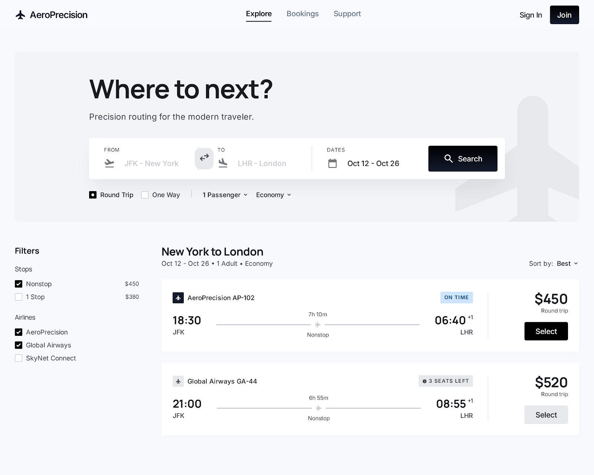

#### Traveler: Round-Trip Selection

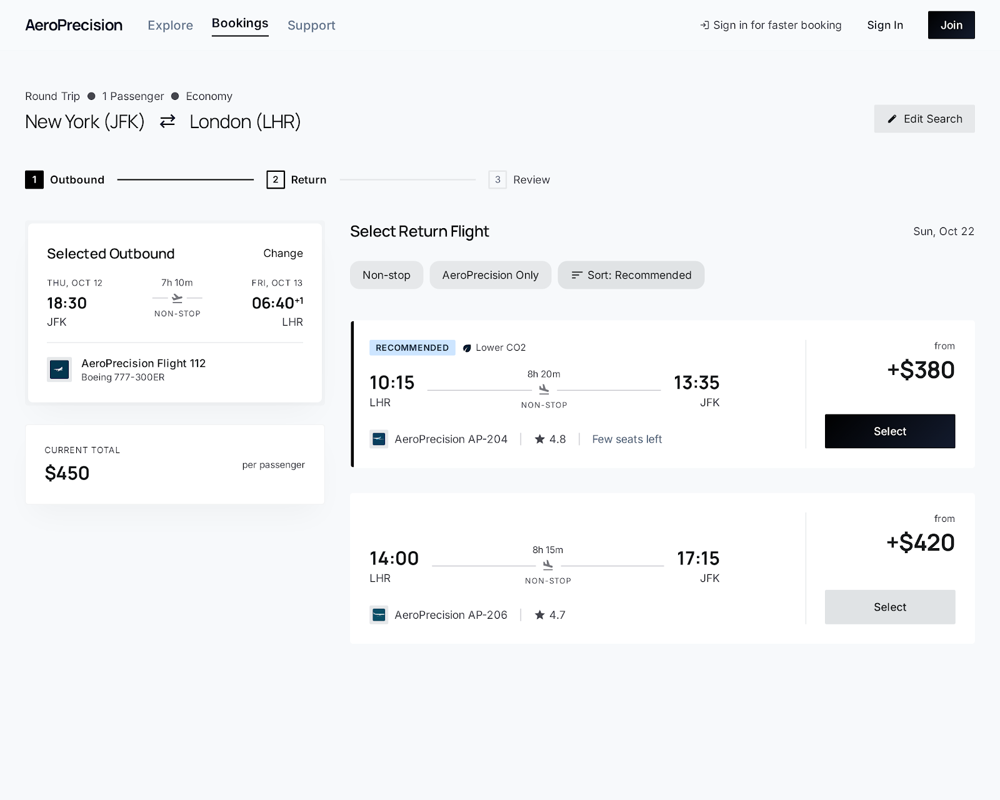

#### Traveler: Booking & Checkout 1

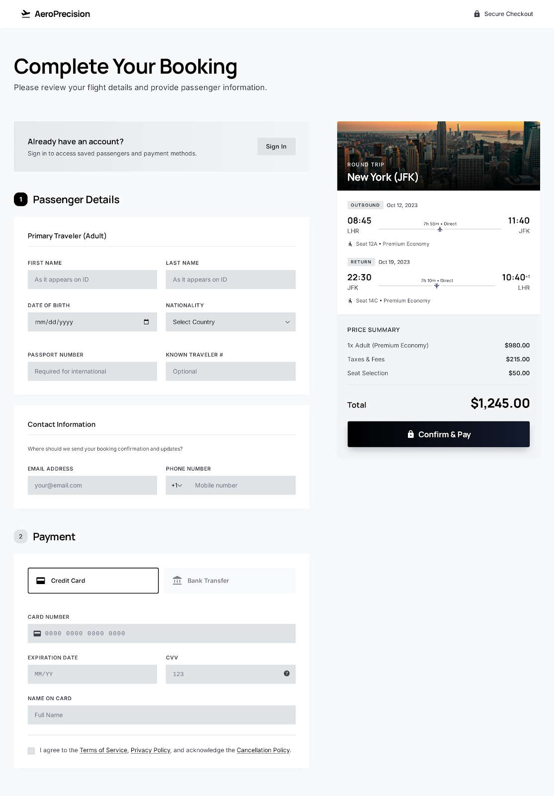

#### Traveler: Booking & Checkout 2

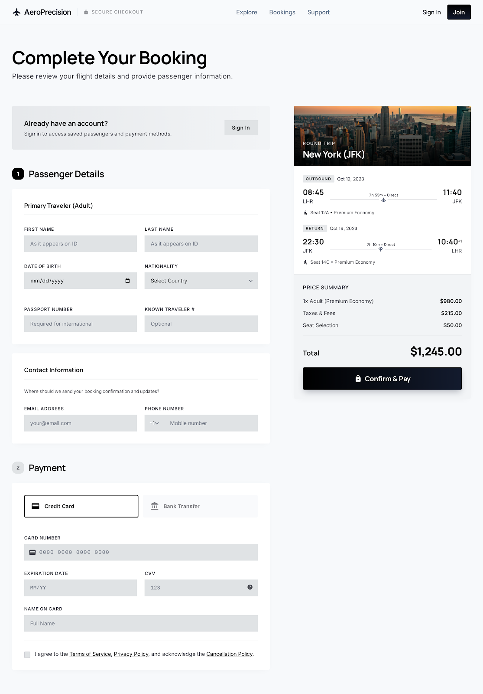

#### Traveler: My Trips Hub

#### Traveler: My Trips History

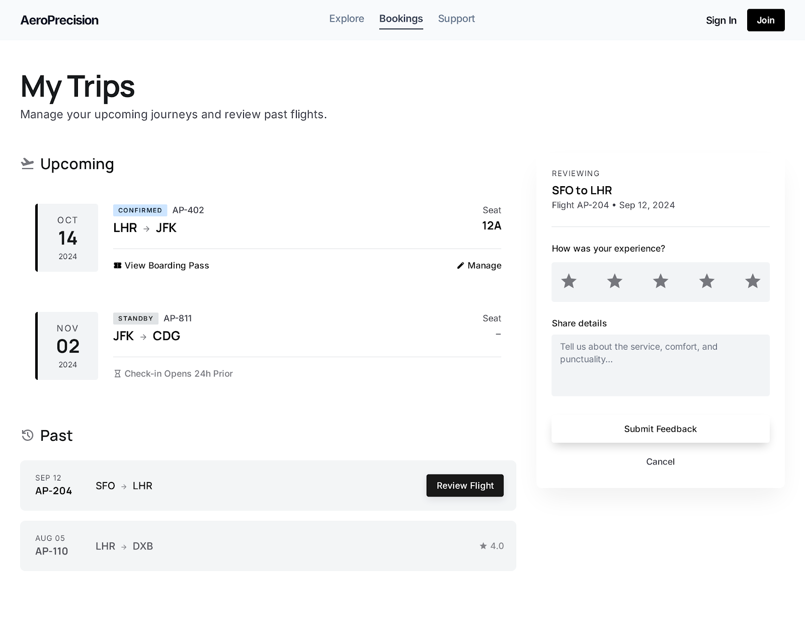

#### Traveler: My Trips Review States

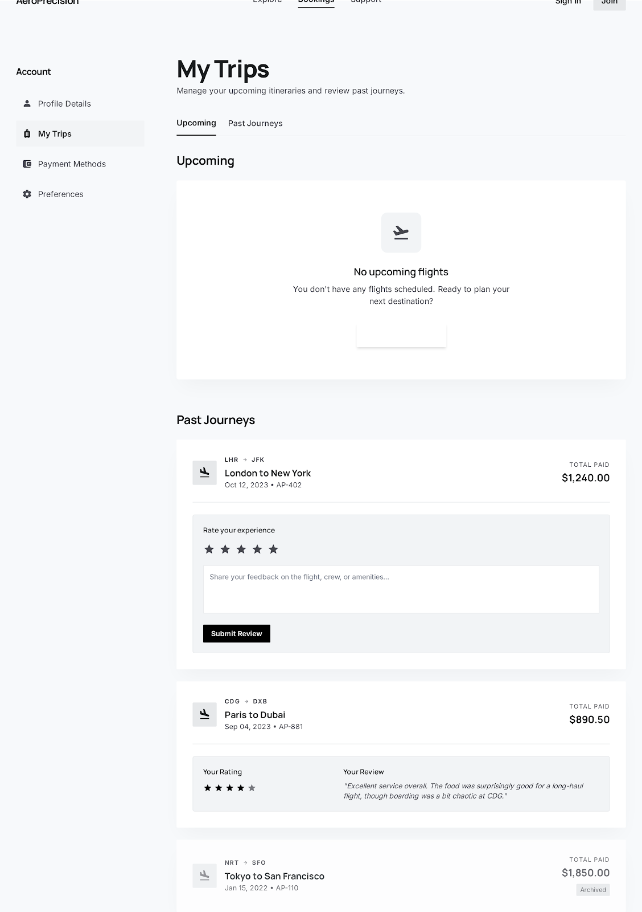

#### Traveler: No Search Results

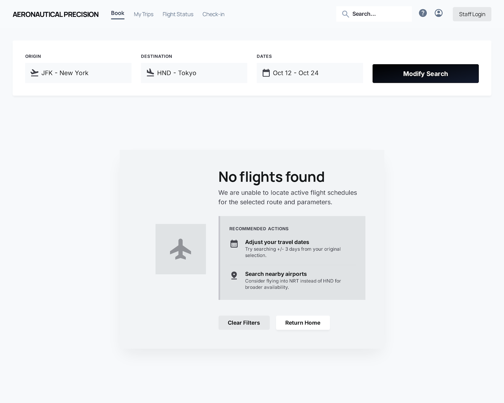

#### Traveler: Payment Methods

#### Traveler: Account Profile

#### Traveler: Account Settings

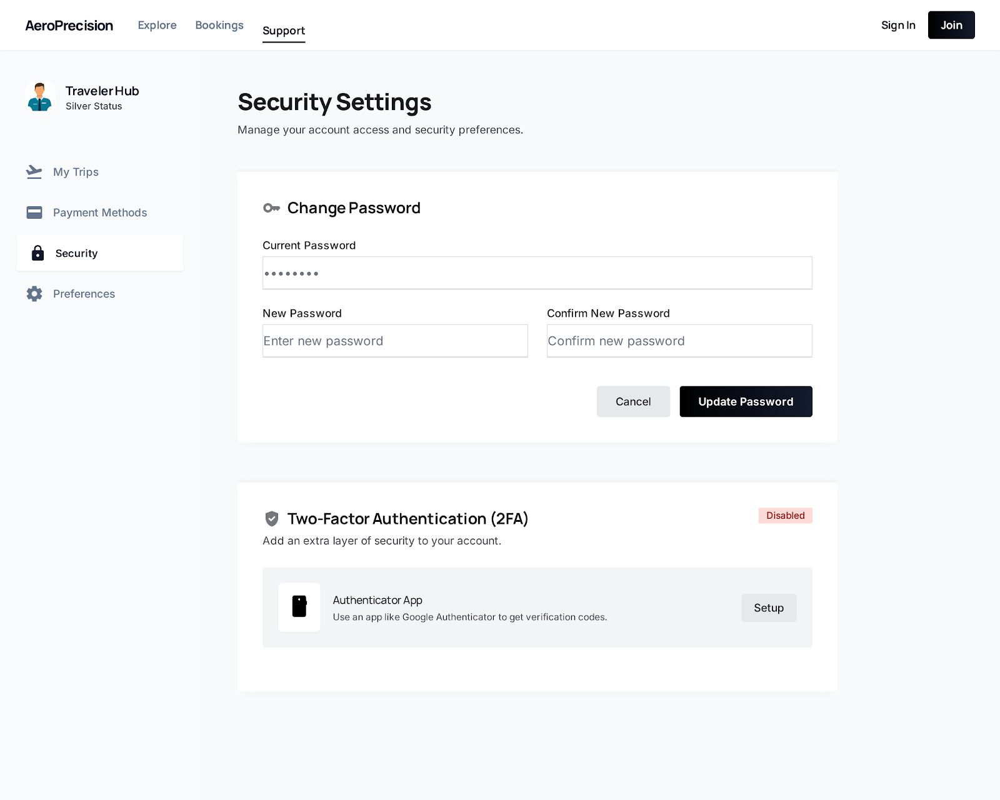

#### Auth: Booking Interruption

### Staff-facing designs

#### Staff: Operations Dashboard

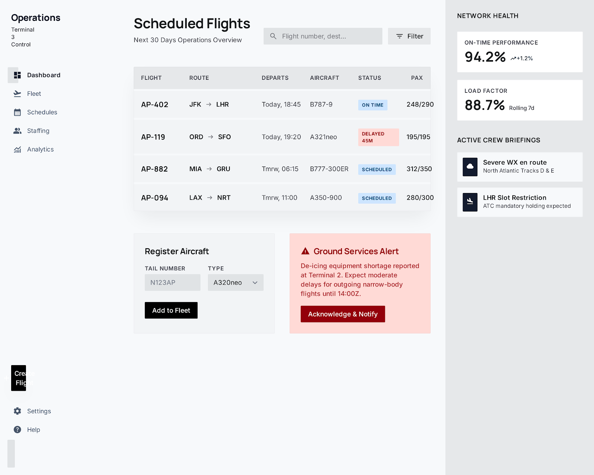

#### Staff: Reporting & Feedback

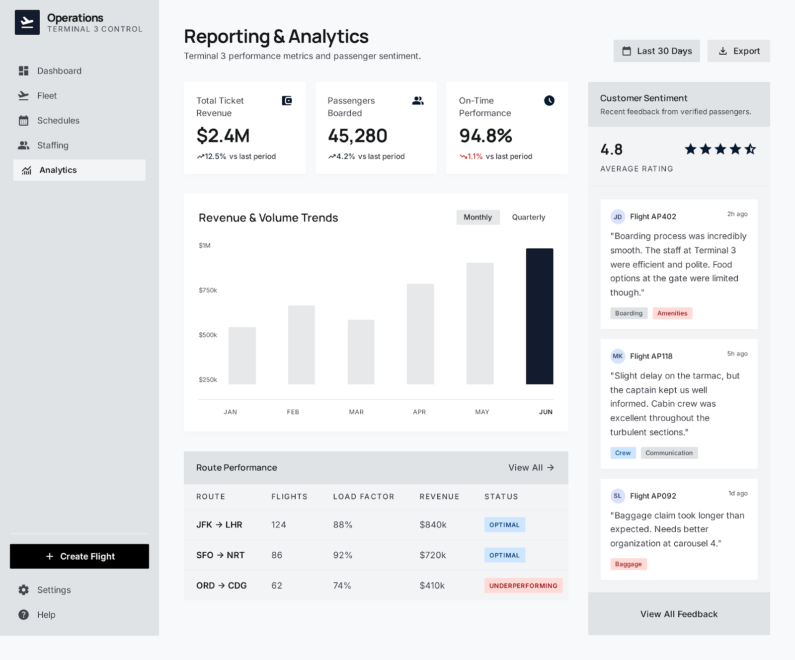

#### Staff: Passenger Manifest

#### Staff: Fleet Management

#### Staff: Flight Creation

#### Staff: Status Update Workflow

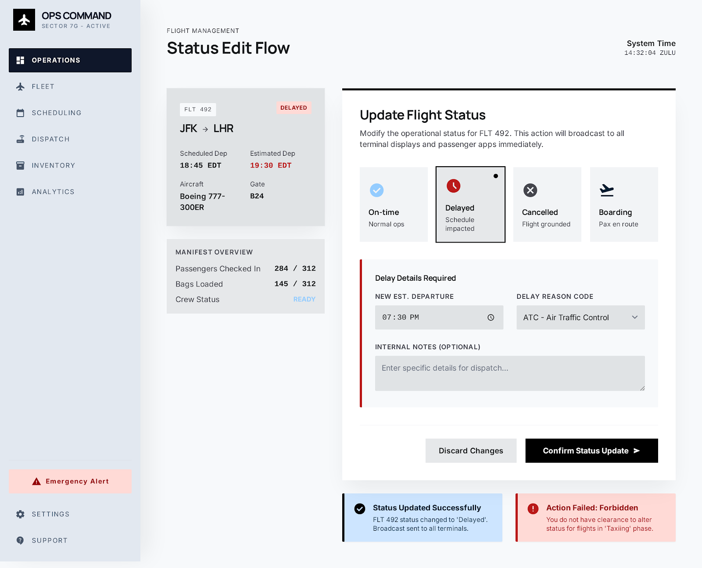
