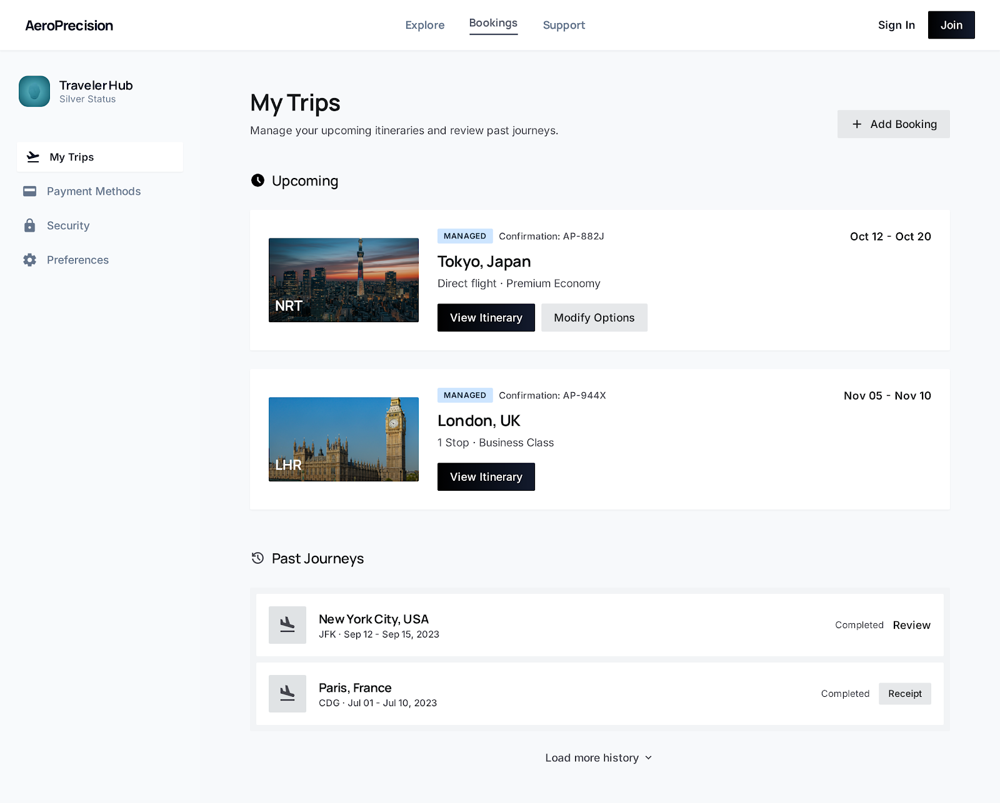
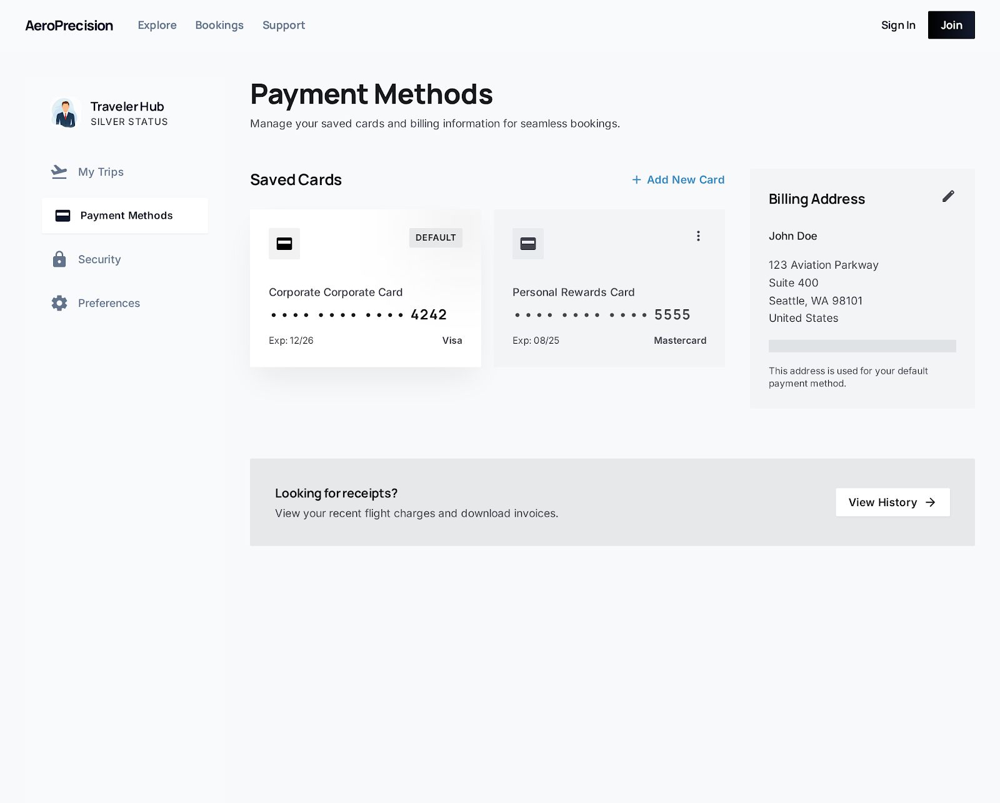
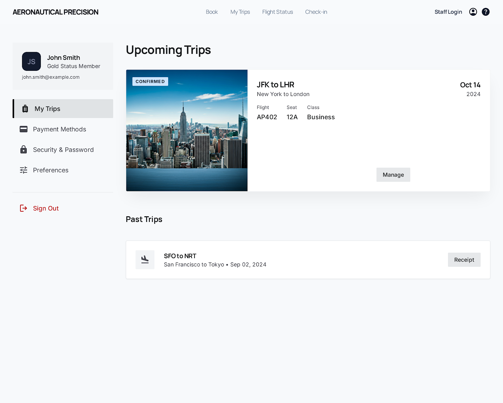
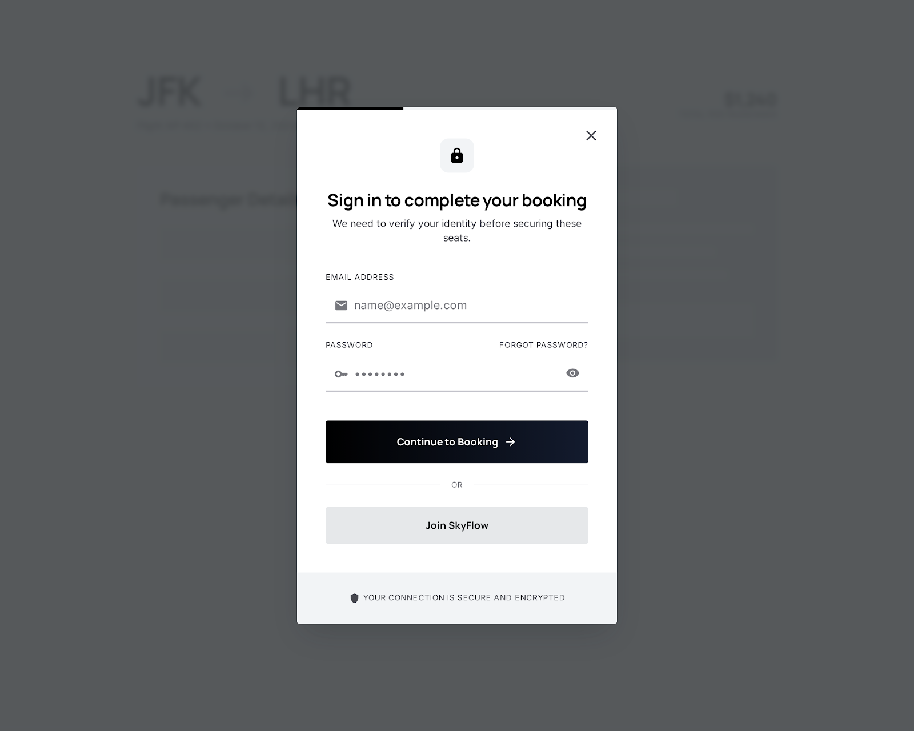
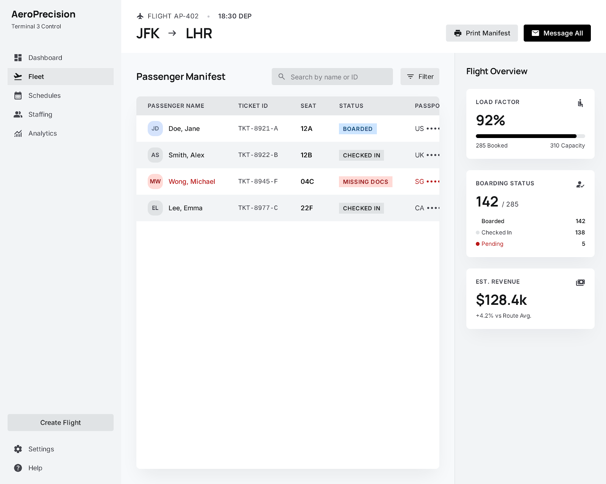
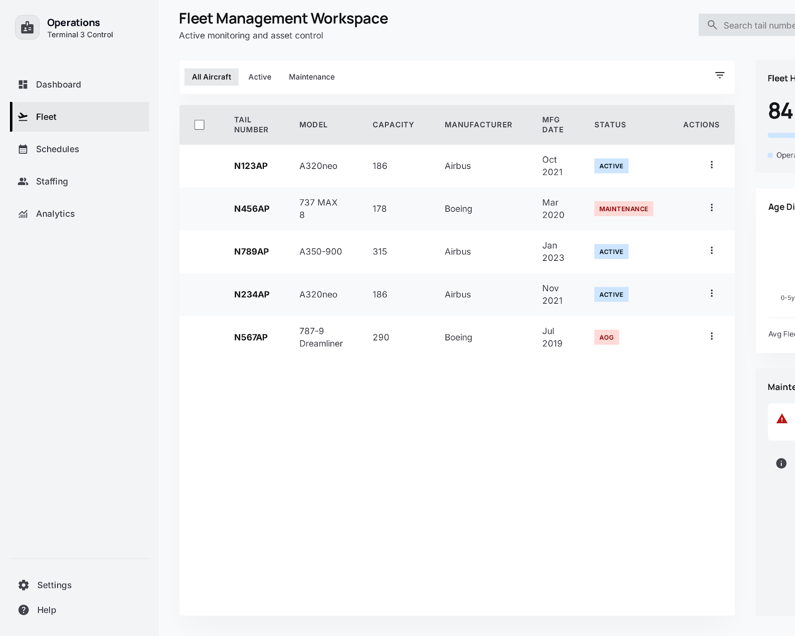
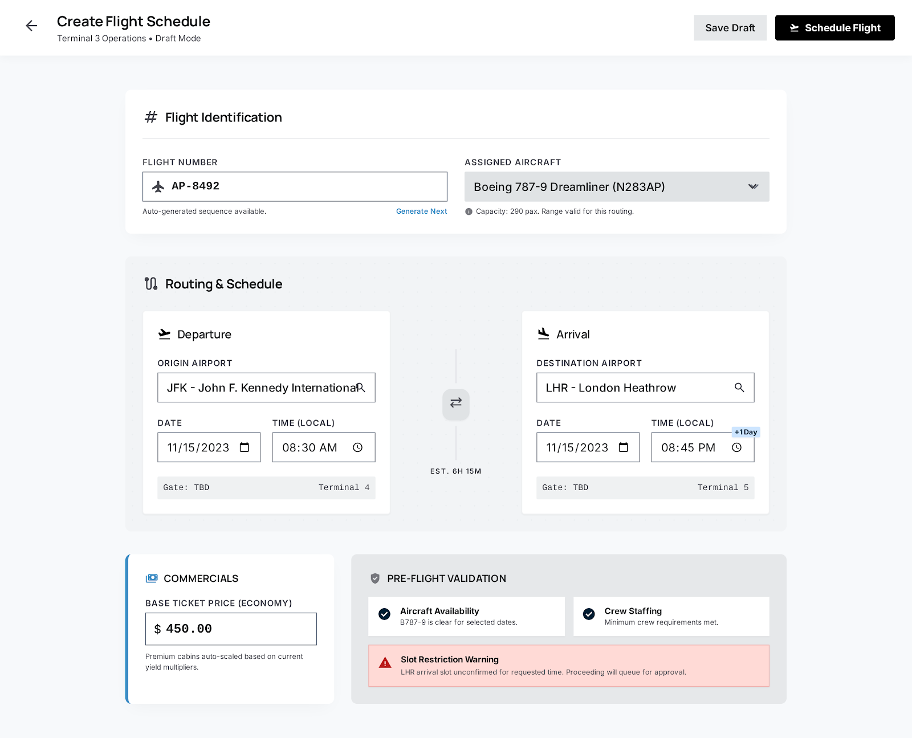

# Part 3 Progress Report

Ka Pui Cheung (they/them)

**Project:** Air Ticket Reservation System Part 3

**Course:** CS-UY 3083 Intro to Databases

## Completed Work So Far

I have successfully completed the local project setup needed to continue building Part 3:

- I have set up the environment variables needed for the application, including the PostgreSQL connection settings and session configuration.
- I have set up the local development server using Bun and Vite.
- I have connected the application to the PostgreSQL database from the earlier project work using the existing Part 2 schema and seeded data.
- I have confirmed that the application can communicate with the backend and database layer through the TanStack Start full-stack application flow.
- I have implemented core backend and server-side application logic using TanStack Start, server-side sessions, `bcrypt`, and explicit SQL queries so the frontend can request and submit real data.

### Backend/Full-Stack Foundation

- project scaffolding for the Part 3 web app
- PostgreSQL integration with the Part 2 schema/data
- server-side session-based authentication
- password hashing with `bcrypt`
- role-aware behavior for customer-facing and staff-facing flows
- public flight-search backend flow
- customer-side booking logic
- completed-flight review logic
- staff-side operational logic for later phases
- validation for several request flows

### UI/UX Design Work

I have also done design work already covers the major product areas for both traveler-facing and staff-facing surfaces.

This design phase is already giving me a strong reference for:

- traveler flight search and booking
- traveler account/trip management
- traveler interruption/auth states
- staff operations dashboard
- staff reporting and feedback
- staff passenger management
- staff fleet management
- staff flight creation and status workflows

## Remaining Work

### Completed Since Last Report

- fully aligned all pages with shadcn/ui components (Input, Button, Label, Select, Textarea, Badge, Field, Card)
- converted auth pages to shadcn block patterns (login-04, signup-04) with two-column Card layouts
- replaced all raw HTML form elements with shadcn equivalents across customer, login, register pages
- replaced raw SVG icons with Lucide React icons across traveler-shell and all route files
- responsive/mobile layout for both traveler and staff interfaces
- all traveler-facing flows fully implemented (search, booking, purchase, reviews, account management)
- all staff-facing flows fully implemented (dashboard, fleet, schedules, ratings, reports)

### Still Remaining

- testing each use case with valid and invalid input
- preparing clean demo data set
- preparing file inventory and use-case report for submission
- preparing for final live demo and code explanation

## UI/UX

### Traveler-facing designs

#### Traveler: Flight Search & Results

#### Traveler: Round-Trip Selection

#### Traveler: Booking & Checkout 1

#### Traveler: Booking & Checkout 2

#### Traveler: My Trips Hub

#### Traveler: My Trips History

#### Traveler: My Trips Review States

#### Traveler: No Search Results

#### Traveler: Payment Methods

#### Traveler: Account Profile

#### Traveler: Account Settings

#### Auth: Booking Interruption

### Staff-facing designs

#### Staff: Operations Dashboard

#### Staff: Reporting & Feedback

#### Staff: Passenger Manifest

#### Staff: Fleet Management

#### Staff: Flight Creation

#### Staff: Status Update Workflow

