# Use Cases and Queries

## Search

The public search page lets anyone browse future flights before signing in. It supports city/code autocomplete, one-way search, round-trip search, flexible "Any origin" / "Any destination" filters, result cards, and client-side sorting by price, duration, departure time, or arrival time. The globe UI uses real route data so the page feels like a travel product rather than a plain database form.

<p>
  
  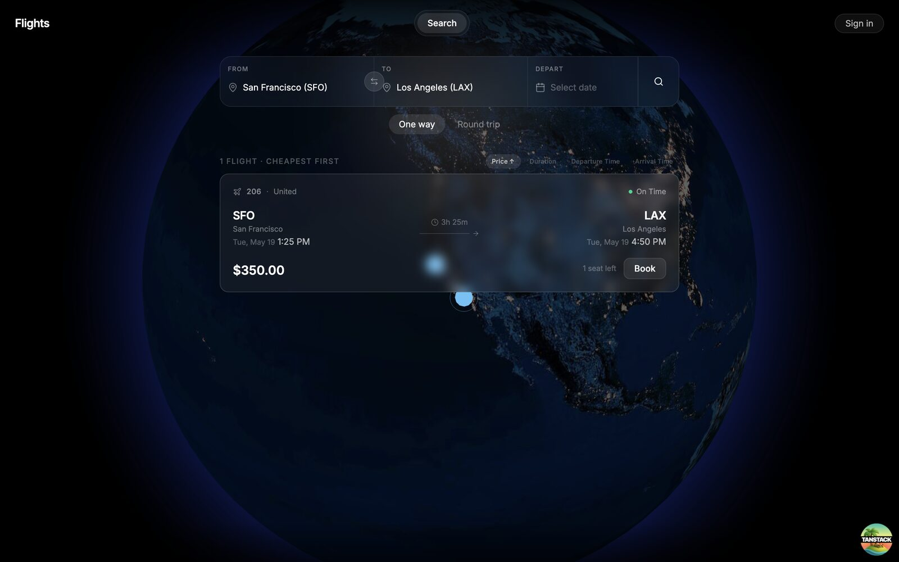
  
</p>

### Globe Routes

> ```sql
> select departure_airport_code, arrival_airport_code
> from (select distinct departure_airport_code, arrival_airport_code from flight) as routes
> order by random()
> limit 10;
> ```
>
> Lists distinct route pairs from the `flight` table for the animated globe arcs.

### Autocomplete

Airport inputs autocomplete from database airports by city, code, or country.

> ```sql
> select city, code, country
> from airport
> where lower(city) like :query
>    or lower(code) like :query
>    or lower(country) like :query
> order by
>   case when lower(code) = lower(:rawQuery) then 0 else 1 end,
>   case when lower(city) = lower(:rawQuery) then 0 else 1 end,
>   city asc,
>   code asc
> limit 8;
> ```
>
> Matches `query` from the `airport` table and ranks exact city/code matches first.

### One-Way and Round-Trip Search

One-way search finds outbound future flights. Round-trip search runs the same query twice: once for the outbound leg, then once with source and destination reversed for the return leg. Blank source or destination means "Any origin" or "Any destination," which makes browsing more flexible than requiring both endpoints.

> ```sql
> select airline_name, airplane_id, flight_number,
>        departure_datetime, arrival_datetime,
>        departure_airport_code, departure_city,
>        arrival_airport_code, arrival_city,
>        base_price, status, ticket_count,
>        available_seats, average_rating, review_count
> from flight_read_model
> where departure_datetime >= now()
>   and (:date::text is null or departure_datetime >= :date::date
>        and departure_datetime < :date::date + interval '1 day')
>   and (:sourceQuery::text is null or lower(departure_city) like :sourceQuery
>        or lower(departure_airport_code) like :sourceQuery)
>   and (:destinationQuery::text is null or lower(arrival_city) like :destinationQuery
>        or lower(arrival_airport_code) like :destinationQuery)
> order by departure_datetime asc;
> ```
>
> Searches future rows from `flight_read_model` by optional date, source, and destination, while also returning price, seats, status, and rating summary data.

## Authentication and Sessions

Customers and staff have separate login/register flows, but both use bcrypt password checks and persistent server-side sessions. Search is public; booking, trips, reviews, profiles, reports, and staff operations require the correct role. Staff registration supports multiple phone numbers; the latest multi-phone state fix is UI-only and does not change the SQL below.

<p>
  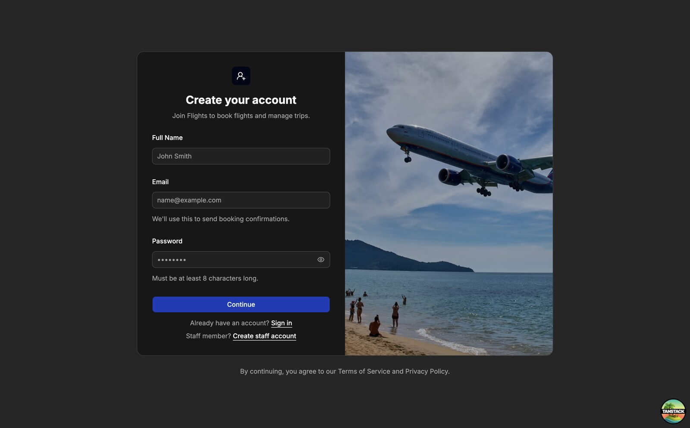
  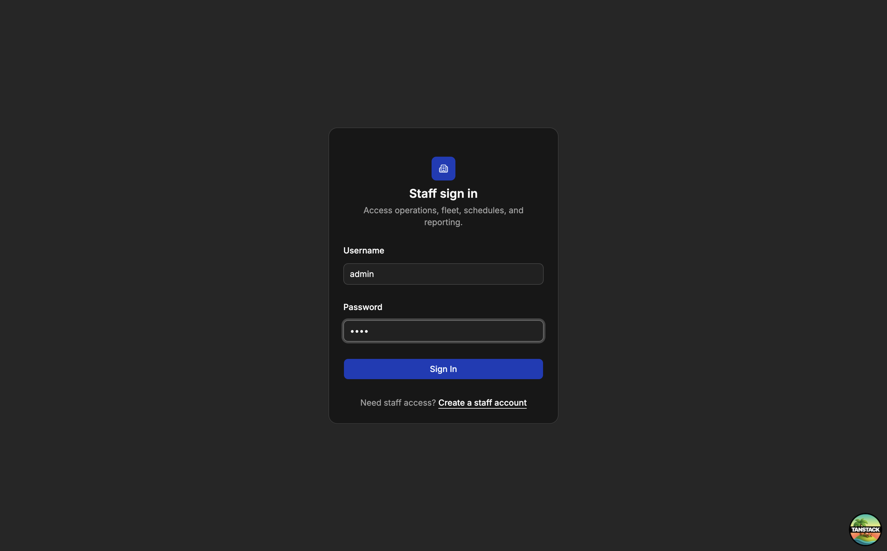
  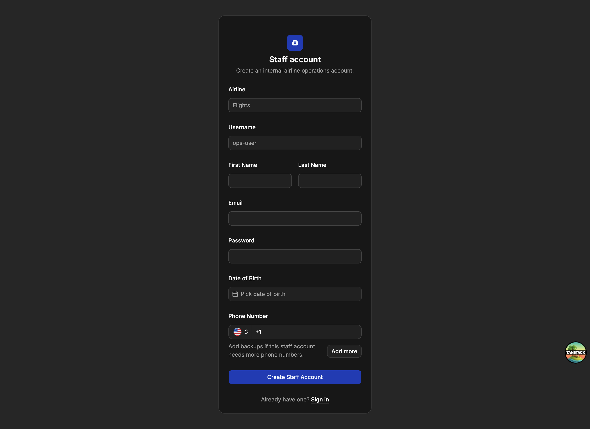
</p>
<p>
  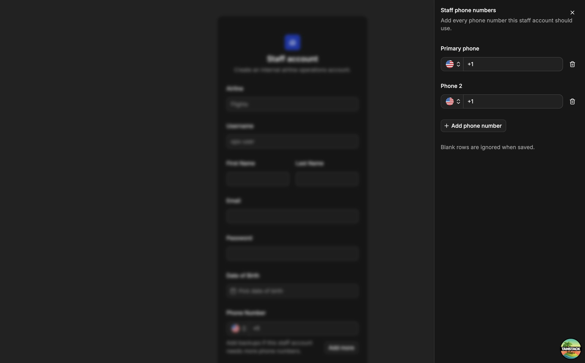
</p>

### Customer Login and Registration

> ```sql
> select email, name, password
> from customer
> where lower(email) = lower(:email)
> limit 1;
> ```
>
> Finds a customer from the `customer` table before password verification or duplicate-email rejection.

> ```sql
> insert into customer (
>   email, name, password, building_number, street, city, state,
>   phone_number, passport_number, passport_expiration,
>   passport_country, date_of_birth
> )
> values (
>   :email, :name, :hashedPassword, :buildingNumber, :street, :city, :state,
>   :phoneNumber, :passportNumber, :passportExpiration,
>   :passportCountry, :dateOfBirth
> );
> ```
>
> Creates a customer account in `customer` with validated profile and passport fields.

### Staff Login and Registration

> ```sql
> select username, airline_name, email, first_name, last_name, password
> from airline_staff
> where lower(username) = lower(:username)
> limit 1;
> ```
>
> Finds a staff account from `airline_staff` before password verification or duplicate-username rejection.

> ```sql
> select name
> from airline
> where name = :airlineName
> limit 1;
> ```
>
> Verifies `airlineName` from the `airline` table before registering staff for that airline.

> ```sql
> insert into airline_staff (
>   username, airline_name, password, first_name, last_name, date_of_birth, email
> )
> values (
>   :username, :airlineName, :hashedPassword,
>   :firstName, :lastName, :dateOfBirth, :email
> );
>
> insert into airline_staff_phone (username, phone_number)
> values (:username, :phoneNumber);
> ```
>
> Creates a staff account in `airline_staff` and stores each phone number in `airline_staff_phone`.

### Session Lookup and Logout

> ```sql
> select role, customer_email, staff_username, expires_at
> from app_session
> where id = :sessionId
>   and expires_at > now()
> limit 1;
> ```
>
> Resolves the current role from `app_session` for route guards and server actions.

> ```sql
> insert into app_session (id, role, customer_email, staff_username, expires_at)
> values (:sessionId, :role, :customerEmail, :staffUsername, :expiresAt);
>
> delete from app_session
> where id = :sessionId;
> ```
>
> Creates or deletes persistent sessions in `app_session` during login, registration, and logout.

## Checkout and Ticket Purchase

Checkout is a dedicated transactional flow with selected itinerary summary, payment fields, validation, and confirmation. A round trip is stored as two tickets. The server locks the flight, checks it is future-dated, checks capacity, and then inserts the ticket.

<p>
  
</p>

> ```sql
> select f.base_price,
>        f.departure_datetime,
>        f.departure_datetime > now() as is_future,
>        airplane.number_of_seats
> from flight f
> join airplane on airplane.airline_name = f.airline_name
>   and airplane.airplane_id = f.airplane_id
> where f.airline_name = :airlineName
>   and f.flight_number = :flightNumber
>   and f.departure_datetime = :departureDatetime::text::timestamp
> for update;
> ```
>
> Locks the selected `flight` row and reads capacity from `airplane` before purchase.

> ```sql
> select count(*)::int as ticket_count
> from ticket
> where airline_name = :airlineName
>   and flight_number = :flightNumber
>   and departure_datetime = :departureDatetime;
> ```
>
> Counts existing `ticket` rows for the flight so sold seats cannot exceed capacity.

> ```sql
> insert into ticket (
>   ticket_id, customer_email, airline_name, flight_number, departure_datetime,
>   purchase_datetime, card_type, card_number, name_on_card, card_expiration
> )
> values (
>   :ticketId, :customerEmail, :airlineName, :flightNumber,
>   :departureDatetime::text::timestamp,
>   now(), :cardType, :cardNumber, :nameOnCard, :cardExpiration
> );
> ```
>
> Inserts a confirmed purchase into `ticket` with server-generated purchase time. The `departure_datetime` value is serialized back to SQL timestamp text before insertion so the ticket foreign key preserves the seeded flight row's second precision.

## Customer Trips and Reviews

The trips page separates upcoming and past flights. Review controls appear only for completed purchased flights that have not already been reviewed.

<p>
  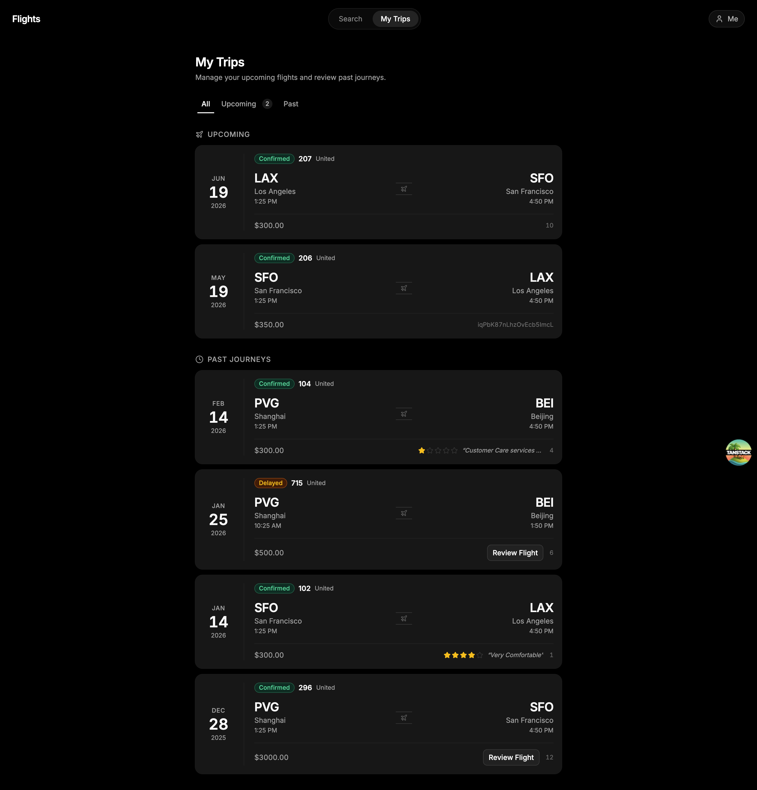
  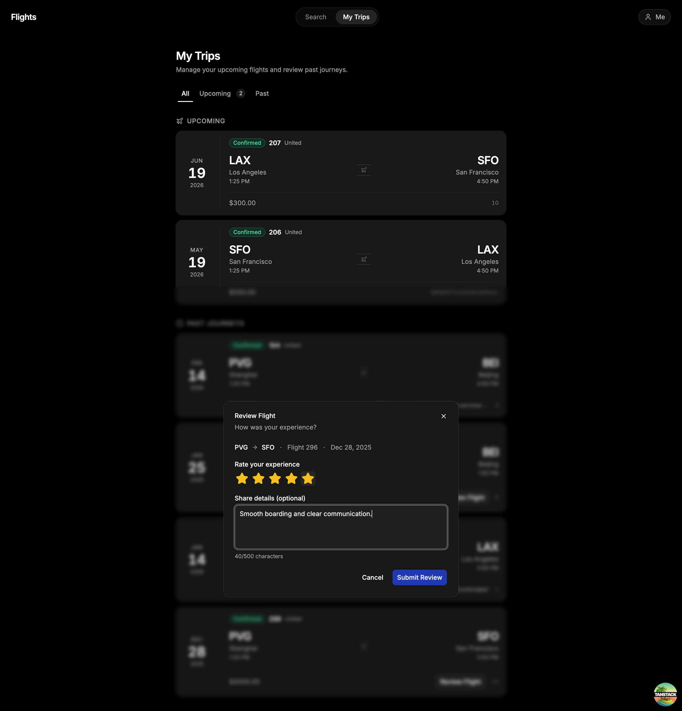
</p>

### View My Flights

> ```sql
> select flight_read_model.airline_name,
>        flight_read_model.flight_number,
>        flight_read_model.departure_datetime,
>        flight_read_model.arrival_datetime,
>        flight_read_model.departure_city,
>        flight_read_model.arrival_city,
>        flight_read_model.base_price,
>        flight_read_model.status,
>        ticket.ticket_id,
>        ticket.purchase_datetime,
>        review.rating,
>        review.comment
> from ticket
> join flight_read_model on flight_read_model.airline_name = ticket.airline_name
>   and flight_read_model.flight_number = ticket.flight_number
>   and flight_read_model.departure_datetime = ticket.departure_datetime
> left join review on review.customer_email = ticket.customer_email
>   and review.airline_name = ticket.airline_name
>   and review.flight_number = ticket.flight_number
>   and review.departure_datetime = ticket.departure_datetime
> where ticket.customer_email = :customerEmail
>   and (:startDate::text is null or flight_read_model.departure_datetime >= :startDate::date)
>   and (:endDate::text is null or flight_read_model.departure_datetime < :endDate::date + interval '1 day')
>   and (:sourceQuery::text is null or lower(flight_read_model.departure_city) like :sourceQuery)
>   and (:destinationQuery::text is null or lower(flight_read_model.arrival_city) like :destinationQuery)
> order by flight_read_model.departure_datetime desc;
> ```
>
> Lists a customer's purchased flights from `ticket`, enriched by `flight_read_model` and optional `review` data.

### Submit Review

> ```sql
> select ticket.departure_datetime
> from ticket
> join flight on flight.airline_name = ticket.airline_name
>   and flight.flight_number = ticket.flight_number
>   and flight.departure_datetime = ticket.departure_datetime
> where ticket.customer_email = :customerEmail
>   and ticket.airline_name = :airlineName
>   and ticket.flight_number = :flightNumber
>   and ticket.departure_datetime = :departureDatetime::text::timestamp
>   and flight.arrival_datetime < now()
> except
> select review.departure_datetime
> from review
> where review.customer_email = :customerEmail
>   and review.airline_name = :airlineName
>   and review.flight_number = :flightNumber
> limit 1;
> ```
>
> Checks `ticket`, `flight`, and `review` so only completed, purchased, unreviewed flights can be reviewed.

> ```sql
> insert into review (
>   customer_email, airline_name, flight_number,
>   departure_datetime, rating, comment, review_datetime
> )
> values (
>   :customerEmail, :airlineName, :flightNumber,
>   :departureDatetime::text::timestamp, :rating, :comment, now()
> );
> ```
>
> Inserts the customer rating and comment into `review`. The `departure_datetime` value is serialized back to SQL timestamp text before insertion so the review foreign key matches the exact flight timestamp.

## Customer Account

The account area separates profile, payment history, and security so trips do not become a crowded settings page.

<p>
  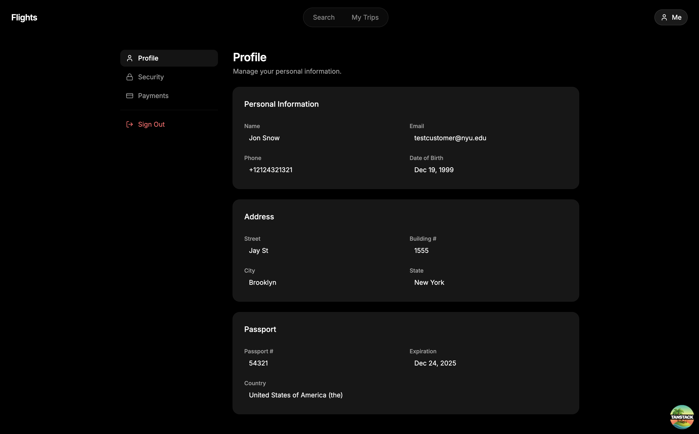
  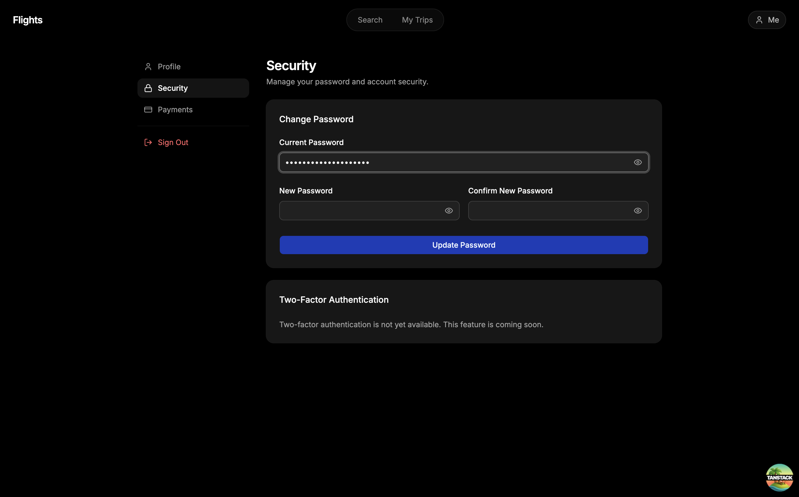
</p>

> ```sql
> select email, name, phone_number, building_number, street, city, state,
>        passport_number, passport_expiration::text as passport_expiration,
>        passport_country, date_of_birth::text as date_of_birth
> from customer
> where email = :customerEmail;
>
> update customer
> set :column = :validatedValue
> where email = :customerEmail;
> ```
>
> Reads and updates validated profile fields in `customer`.

> ```sql
> select distinct on (card_number) card_number, card_type, name_on_card, card_expiration
> from ticket
> where customer_email = :customerEmail
> order by card_number, card_expiration desc;
> ```
>
> Lists previously used payment cards from `ticket`.

> ```sql
> select password from customer where email = :customerEmail;
>
> update customer
> set password = :hashedPassword
> where email = :customerEmail;
> ```
>
> Checks and updates the customer's bcrypt password in `customer`.

## Staff Dashboard and Reports

The staff dashboard uses a left-nav operations layout with dense tables, filters, charts, and role-aware actions. Normal staff are scoped to their airline through `airlineScope`; superadmins can view all airlines. Staff flight search also ensures `flight_read_model` exists before querying it. (This level of role-based access was not required by this project, but I felt like doing it.)

<p>
  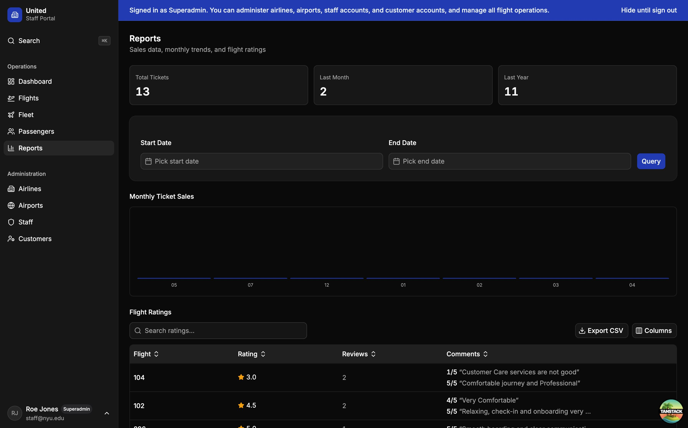
  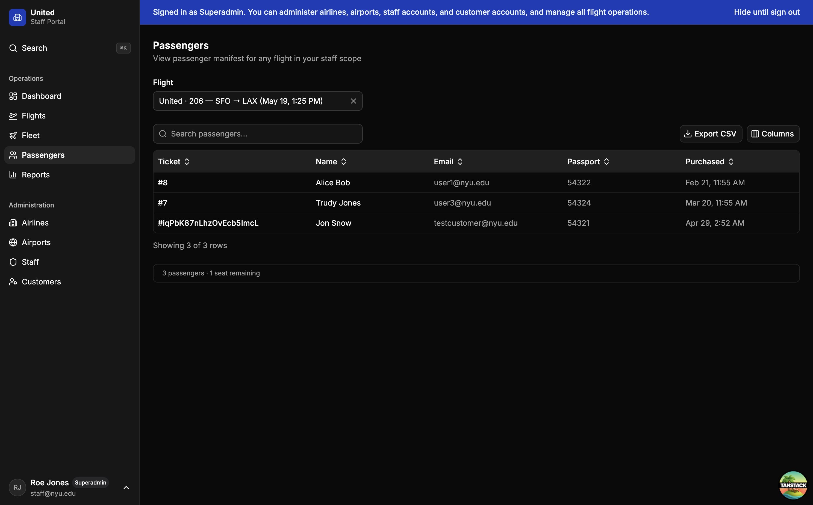
</p>

### Flight, Fleet, and Review Overview

> ```sql
> select airline_name, airplane_id, flight_number,
>        departure_datetime, arrival_datetime,
>        departure_city, arrival_city, base_price,
>        status, ticket_count, available_seats,
>        average_rating, review_count
> from flight_read_model
> where (:airlineScope::text is null or airline_name = :airlineScope)
>   and ((:startDate::text is null and :endDate::text is null
>         and departure_datetime between now() and now() + make_interval(days => 30))
>        or (:startDate::text is not null and departure_datetime >= :startDate::date))
>   and (:endDate::text is null or departure_datetime < :endDate::date + interval '1 day')
> order by departure_datetime asc;
> ```
>
> Lists staff-visible flights from `flight_read_model`, defaulting to the next 30 days.

> ```sql
> select airline_name, airplane_id, manufacturing_company,
>        manufacturing_date::text as manufacturing_date, number_of_seats
> from airplane
> where (:airlineScope::text is null or airline_name = :airlineScope)
> order by airline_name asc, airplane_id asc;
> ```
>
> Lists manageable aircraft from `airplane`.

> ```sql
> select f.airline_name, f.flight_number, f.departure_datetime,
>        review.rating, review.comment
> from flight f
> join review on review.airline_name = f.airline_name
>   and review.flight_number = f.flight_number
>   and review.departure_datetime = f.departure_datetime
> where (:airlineScope::text is null or f.airline_name = :airlineScope)
> order by f.departure_datetime desc, review.review_datetime asc;
> ```
>
> Lists flight reviews from `review` for staff rating summaries.

### Sales Reports

> ```sql
> select count(*)::int as total_tickets,
>        count(*) filter (where purchase_datetime >= now() - interval '1 month')::int as last_month_tickets,
>        count(*) filter (where purchase_datetime >= now() - interval '1 year')::int as last_year_tickets
> from ticket
> where (:airlineScope::text is null or airline_name = :airlineScope);
>
> select date_trunc('month', purchase_datetime)::text as month_start,
>        count(*)::int as tickets_sold
> from ticket
> where (:airlineScope::text is null or airline_name = :airlineScope)
>   and purchase_datetime >= now() - interval '12 month'
> group by date_trunc('month', purchase_datetime)
> order by date_trunc('month', purchase_datetime) asc;
>
> select count(*)::int as tickets_sold
> from ticket
> where (:airlineScope::text is null or airline_name = :airlineScope)
>   and purchase_datetime >= :startDate::date
>   and purchase_datetime < :endDate::date + interval '1 day';
> ```
>
> Counts total, recent, monthly, and custom-range ticket sales from `ticket`.

## Staff Flight Management

Staff can create flights, edit fields, update status, and delete flights when safe. The UI uses tables and inline editing, but server-side checks enforce permissions, airport validity, capacity, and dependency rules.

<p>
  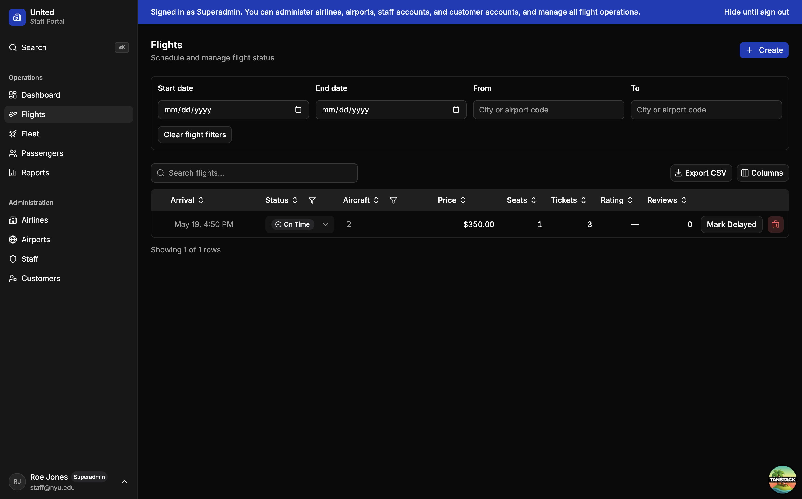
  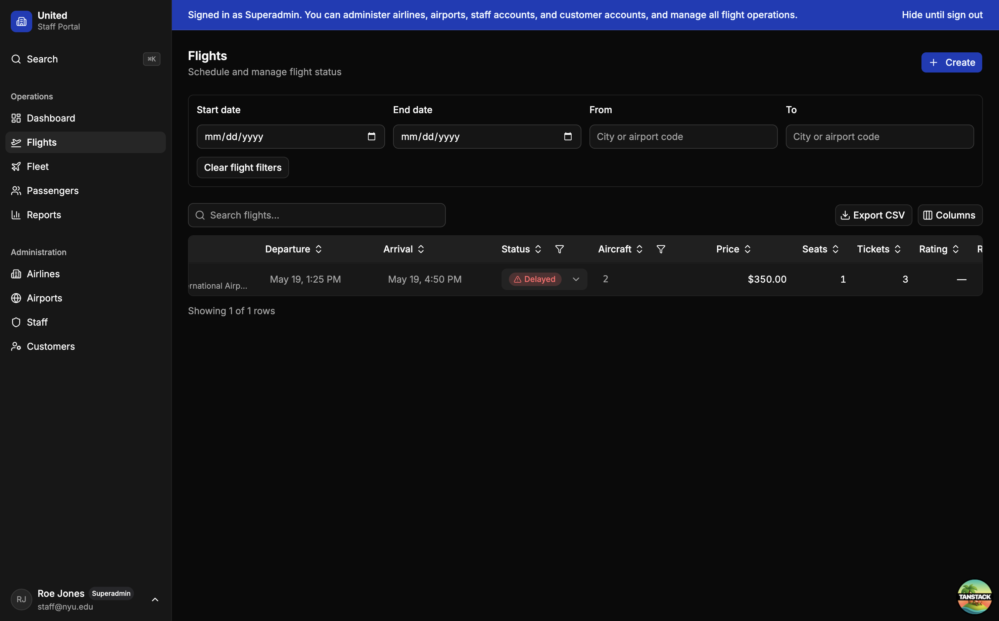
</p>
<p>
  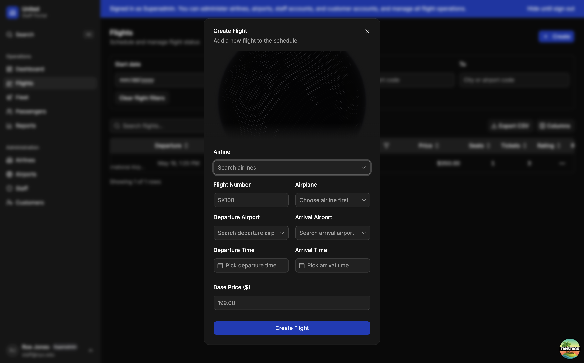
</p>

> ```sql
> select name from airline where name = :airlineName limit 1;
> select airplane_id from airplane
> where airline_name = :airlineName and airplane_id = :airplaneId
> limit 1;
>
> insert into flight (
>   airline_name, flight_number, departure_datetime,
>   departure_airport_code, arrival_airport_code, arrival_datetime,
>   base_price, status, airplane_id
> )
> values (
>   :airlineName, :flightNumber, :departureDatetime::text::timestamp,
>   :departureAirportCode, :arrivalAirportCode, :arrivalDatetime::text::timestamp,
>   :basePrice, 'on_time', :airplaneId
> );
> ```
>
> Creates a flight in `flight` after airline, airplane, airport, and time validation.

> ```sql
> select airline_name, flight_number,
>        departure_datetime::text as departure_datetime,
>        departure_airport_code, arrival_airport_code,
>        arrival_datetime::text as arrival_datetime,
>        base_price, status, airplane_id
> from flight
> where airline_name = :airlineName
>   and flight_number = :flightNumber
>   and departure_datetime = :departureDatetime::text::timestamp
> limit 1;
> ```
>
> Finds the exact `flight` row before staff mutations. `departure_datetime` and `arrival_datetime` are selected as text so later mutation comparisons use consistent second-precision timestamp strings.

> ```sql
> update flight set status = :status where airline_name = :airlineName and flight_number = :flightNumber and departure_datetime = :departureDatetime::text::timestamp;
> update flight set base_price = :basePrice where airline_name = :airlineName and flight_number = :flightNumber and departure_datetime = :departureDatetime::text::timestamp;
> update flight set departure_airport_code = :code where airline_name = :airlineName and flight_number = :flightNumber and departure_datetime = :departureDatetime::text::timestamp;
> update flight set arrival_airport_code = :code where airline_name = :airlineName and flight_number = :flightNumber and departure_datetime = :departureDatetime::text::timestamp;
> update flight set departure_datetime = :newDeparture::text::timestamp where airline_name = :airlineName and flight_number = :flightNumber and departure_datetime = :oldDeparture::text::timestamp;
> update flight set arrival_datetime = :newArrival::text::timestamp where airline_name = :airlineName and flight_number = :flightNumber and departure_datetime = :departureDatetime::text::timestamp;
> ```
>
> Updates editable `flight` fields after validating status, airports, and time order. Staff flight mutation paths normalize `departure_datetime` with serialize/normalize timestamp forms and compare as `::text::timestamp`, which keeps second-precision primary key comparisons and flight foreign keys stable.

> ```sql
> select airplane.number_of_seats, count(ticket.ticket_id)::int as ticket_count
> from airplane
> left join ticket on ticket.airline_name = :airlineName
>   and ticket.flight_number = :flightNumber
>   and ticket.departure_datetime = :departureDatetime::text::timestamp
> where airplane.airline_name = :airlineName
>   and airplane.airplane_id = :airplaneId
> group by airplane.number_of_seats
> limit 1;
>
> update flight
> set airplane_id = :airplaneId
> where airline_name = :airlineName
>   and flight_number = :flightNumber
>   and departure_datetime = :departureDatetime::text::timestamp;
> ```
>
> Changes a flight aircraft only if the new `airplane` has enough seats for sold `ticket` rows.

> ```sql
> select exists (select 1 from ticket where airline_name = :airlineName and flight_number = :flightNumber and departure_datetime = :departureDatetime::text::timestamp) as has_tickets,
>        exists (select 1 from review where airline_name = :airlineName and flight_number = :flightNumber and departure_datetime = :departureDatetime::text::timestamp) as has_reviews;
>
> delete from flight
> where airline_name = :airlineName
>   and flight_number = :flightNumber
>   and departure_datetime = :departureDatetime::text::timestamp;
> ```
>
> Deletes a `flight` only when no `ticket` or `review` rows depend on it.

## Staff Fleet and Passenger Manifest

Fleet management lets staff add, edit, and delete airplanes. The manifest page lists customers on a selected flight.

<p>
  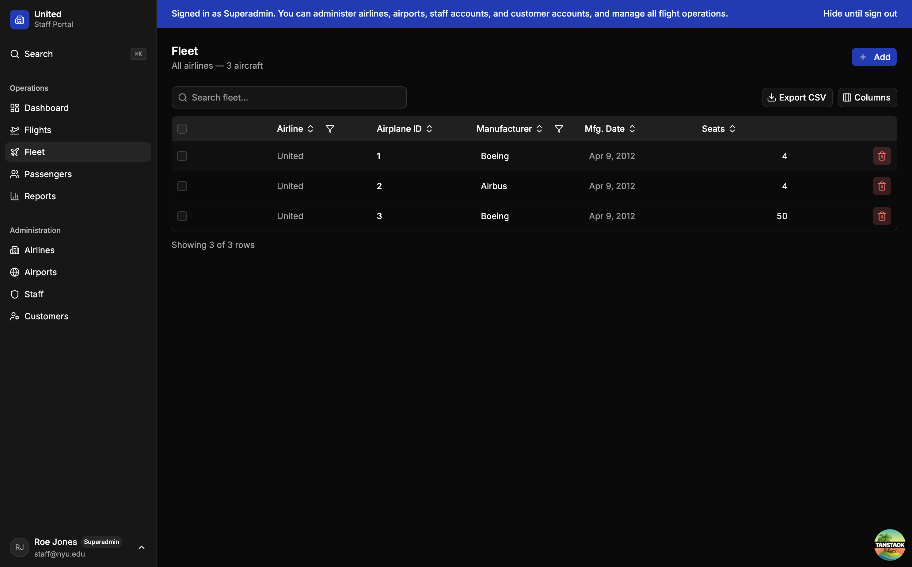
  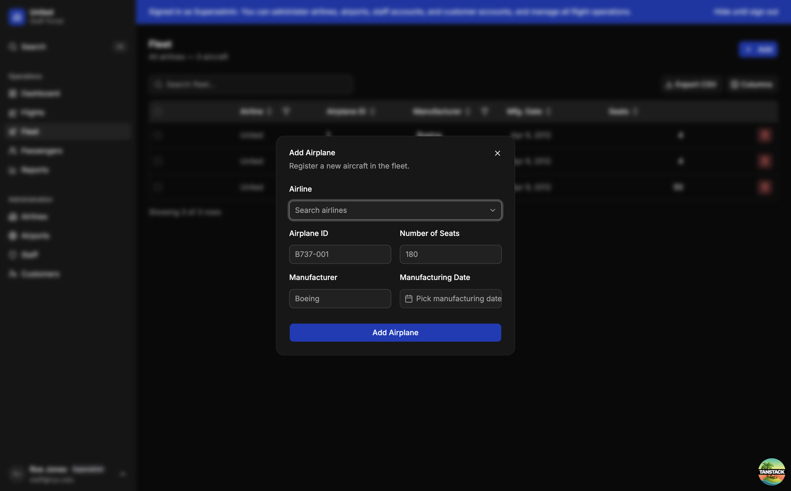
</p>

> ```sql
> insert into airplane (airline_name, airplane_id, number_of_seats, manufacturing_company, manufacturing_date)
> values (:airlineName, :airplaneId, :numberOfSeats, :manufacturingCompany, :manufacturingDate);
>
> update airplane set manufacturing_company = :company where airline_name = :airlineName and airplane_id = :airplaneId;
> update airplane set manufacturing_date = :date where airline_name = :airlineName and airplane_id = :airplaneId;
> update airplane set number_of_seats = :numberOfSeats where airline_name = :airlineName and airplane_id = :airplaneId;
> ```
>
> Creates and updates `airplane` records after staff airline authorization and seat-count validation.

> ```sql
> select coalesce(max(ticket_counts.ticket_count), 0)::int as max_tickets
> from airplane
> left join flight on flight.airline_name = airplane.airline_name
>   and flight.airplane_id = airplane.airplane_id
> left join lateral (
>   select count(*)::int as ticket_count
>   from ticket
>   where ticket.airline_name = flight.airline_name
>     and ticket.flight_number = flight.flight_number
>     and ticket.departure_datetime = flight.departure_datetime
> ) as ticket_counts on true
> where airplane.airline_name = :airlineName
>   and airplane.airplane_id = :airplaneId;
> ```
>
> Finds the maximum sold-ticket count before lowering an airplane's seat count.

> ```sql
> select count(*)::int as flight_count
> from flight
> where airline_name = :airlineName
>   and airplane_id = :airplaneId;
>
> delete from airplane
> where airline_name = :airlineName
>   and airplane_id = :airplaneId;
> ```
>
> Deletes an `airplane` only when no `flight` rows use it.

> ```sql
> select ticket.ticket_id, ticket.customer_email,
>        customer.name as customer_name,
>        customer.passport_number,
>        ticket.purchase_datetime
> from ticket
> join customer on customer.email = ticket.customer_email
> where ticket.airline_name = :airlineName
>   and ticket.flight_number = :flightNumber
>   and ticket.departure_datetime = :departureDatetime::text::timestamp
> order by ticket.purchase_datetime asc;
> ```
>
> Lists passengers from `ticket` joined to `customer` for an authorized flight.

## Staff Profile and Security

<p>
  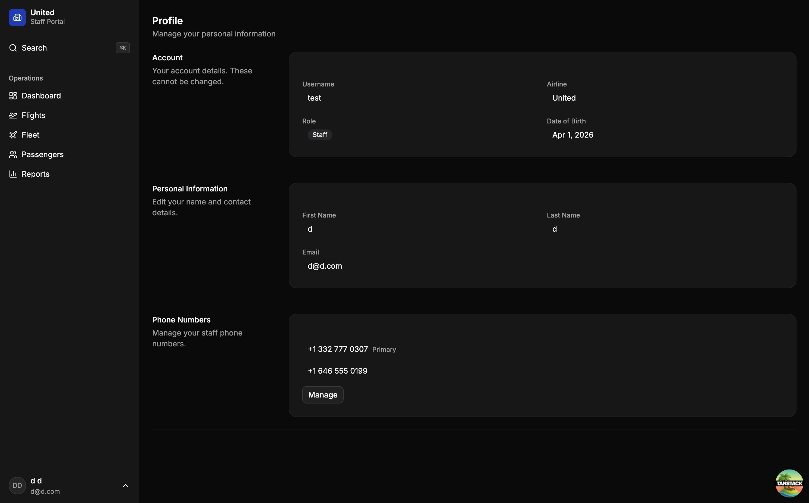
  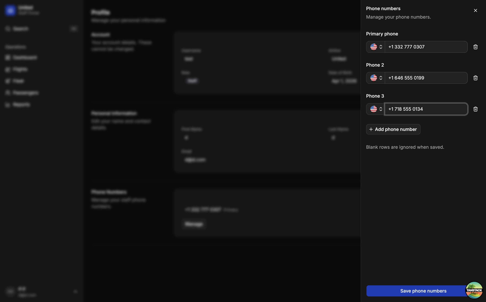
</p>

> ```sql
> select username, airline_name, first_name, last_name, email,
>        date_of_birth::text as date_of_birth
> from airline_staff
> where username = :staffUsername
> limit 1;
>
> select phone_number
> from airline_staff_phone
> where username = :staffUsername
> order by phone_number asc;
> ```
>
> Reads the logged-in staff profile from `airline_staff` and `airline_staff_phone`.

> ```sql
> update airline_staff
> set :column = :validatedValue
> where username = :staffUsername;
>
> delete from airline_staff_phone where username = :staffUsername;
> insert into airline_staff_phone (username, phone_number) values (:staffUsername, :phoneNumber);
> ```
>
> Updates staff profile fields and replaces phone numbers in the staff tables.

> ```sql
> select password from airline_staff where username = :staffUsername;
> update airline_staff set password = :hashedPassword where username = :staffUsername;
> ```
>
> Checks and updates the staff bcrypt password in `airline_staff`.

## Superadmin Management

Superadmin screens manage system-wide reference and account data. Normal staff do not see these pages.

<p>
  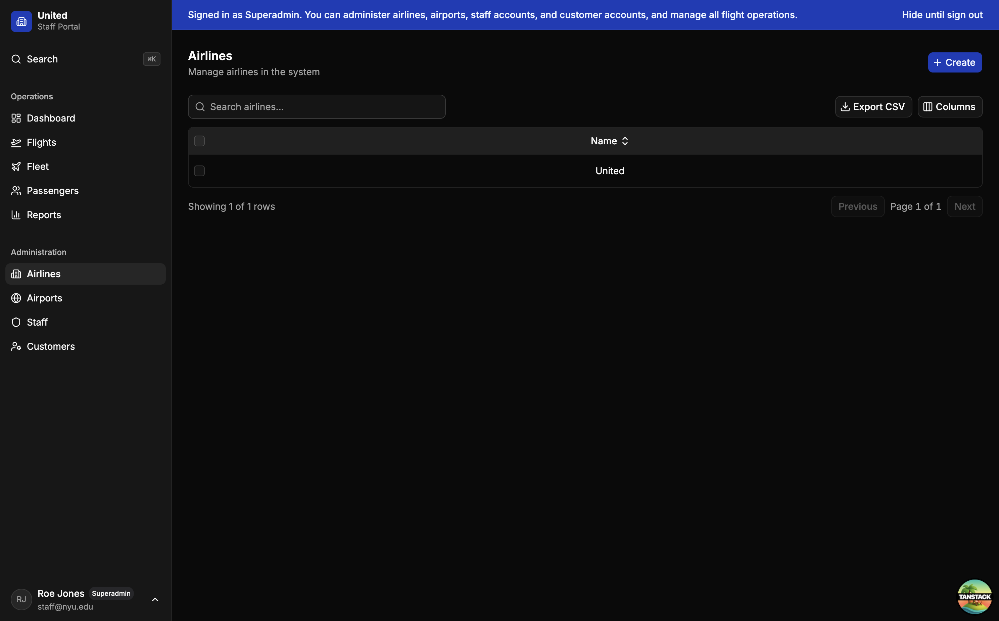
  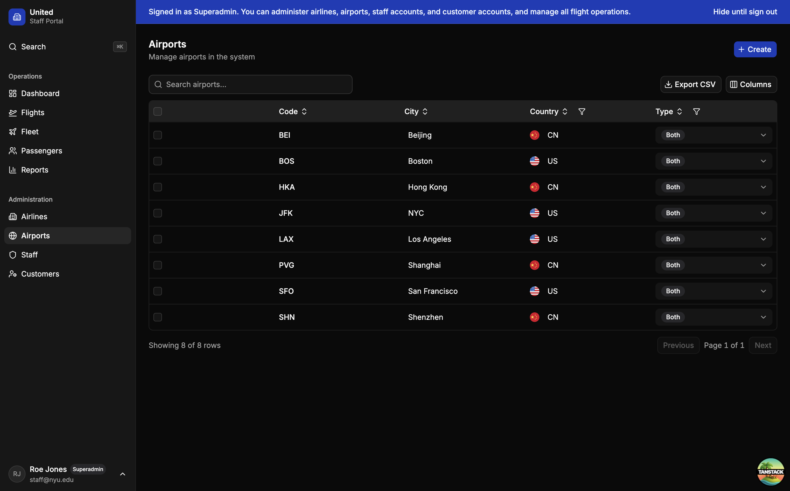
</p>
<p>
  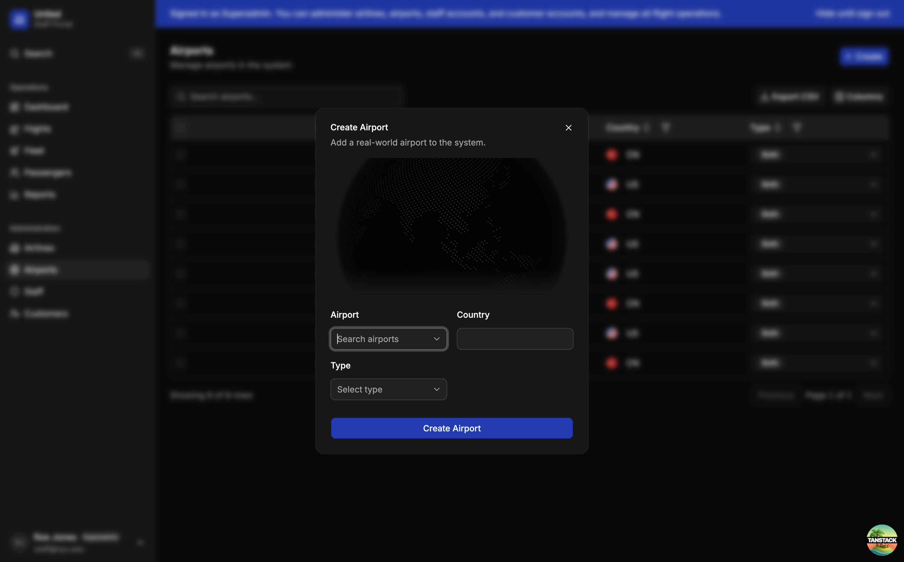
  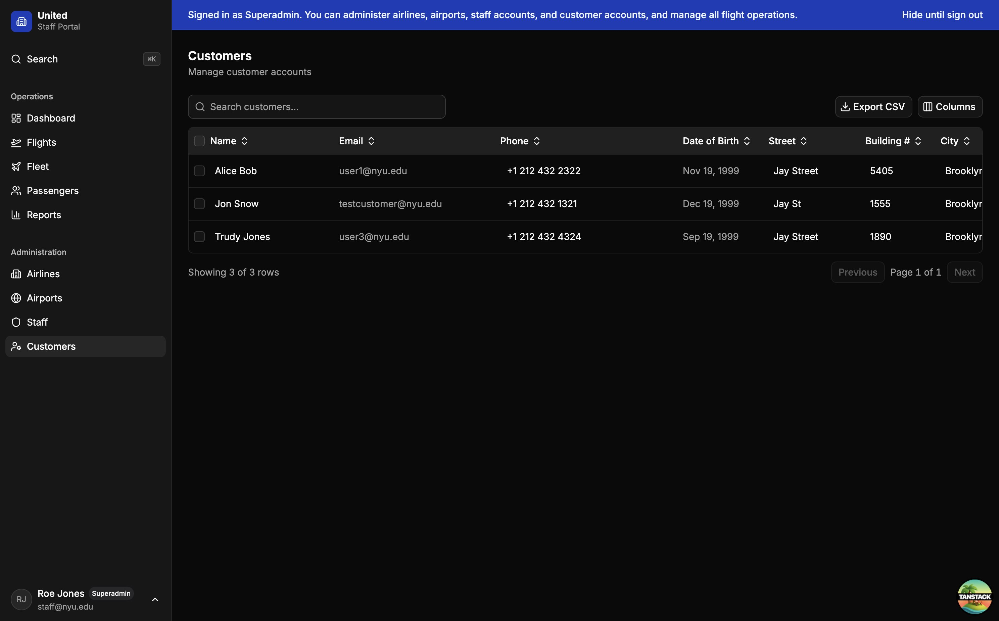
</p>
<p>
  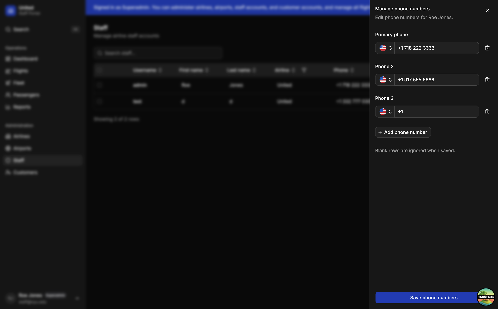
  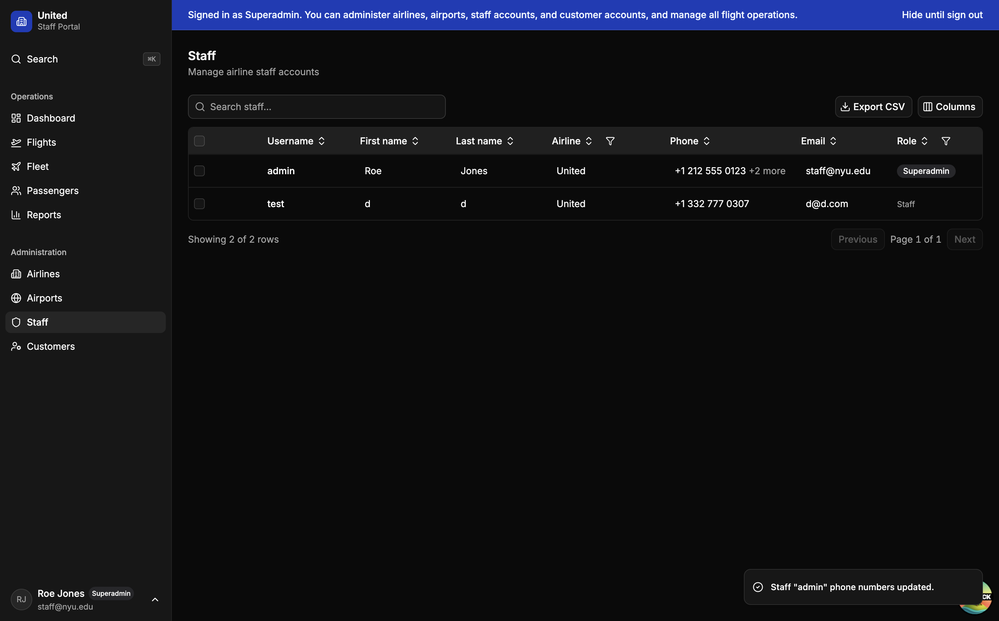
</p>

### Airlines and Airports

> ```sql
> select name from airline order by name asc;
> insert into airline (name) values (:name);
> update airline set name = :newName where name = :oldName;
> delete from airline where name = :name;
>
> select code, city, country, airport_type from airport order by code asc;
> insert into airport (code, city, country, airport_type) values (:code, :city, :country, :airportType);
> update airport set :column = :value where code = :code;
> delete from airport where code = :code;
> ```
>
> Lists, creates, updates, and deletes `airline` and `airport` reference records.

### Staff Accounts

> ```sql
> select airline_staff.username,
>        airline_staff.airline_name,
>        airline_staff.first_name,
>        airline_staff.last_name,
>        airline_staff.email,
>        airline_staff_phone.phone_number
> from airline_staff
> left join airline_staff_phone on airline_staff_phone.username = airline_staff.username
> order by airline_staff.username asc, airline_staff_phone.phone_number asc;
>
> update airline_staff set :column = :validatedValue where username = :username;
> delete from airline_staff_phone where username = :username;
> insert into airline_staff_phone (username, phone_number) values (:username, :phoneNumber);
> delete from airline_staff where username = :username;
> ```
>
> Lists, edits, replaces phone numbers for, and deletes staff accounts using `airline_staff` and `airline_staff_phone`.

### Customer Accounts

> ```sql
> select email, name, phone_number, date_of_birth::text as date_of_birth,
>        building_number, street, city, state,
>        passport_number, passport_expiration::text as passport_expiration,
>        passport_country
> from customer
> order by name asc;
>
> update customer set :column = :validatedValue where email = :email;
>
> select exists (select 1 from ticket where customer_email = :email) as has_tickets,
>        exists (select 1 from review where customer_email = :email) as has_reviews;
>
> delete from customer where email = :email;
> ```
>
> Lists, edits, and deletes `customer` records, while preventing deletion when `ticket` or `review` history exists.
